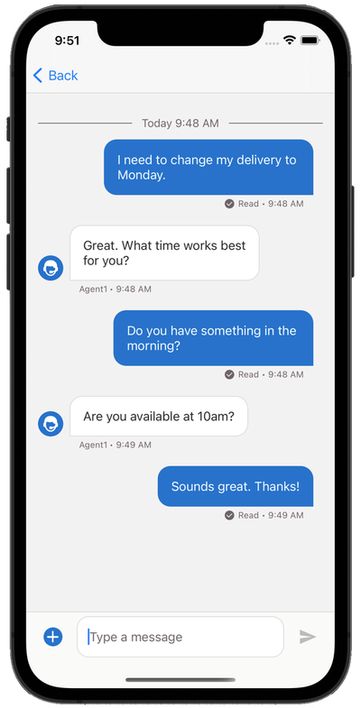

# Salesforce Messaging for In-App (iOS SDK)

Start a new conversation with customers from your Android mobile app. Custom branding and mobile push notifications provide a modern experience.

## iOS Links

- [Messaging for In-App Developer Guide](https://developer.salesforce.com/docs/service/messaging-in-app/overview)
- [iOS Release Notes](https://github.com/Salesforce-Async-Messaging/messaging-in-app-ios/releases)
- [iOS Example Apps](./examples)
- iOS Reference Documentation

## Other Links

- [Salesforce Org Setup Instructions](https://help.salesforce.com/s/articleView?id=sf.miaw_intro_landing.htm)
- [Android Messaging for In-App GitHub Repo](https://github.com/Salesforce-Async-Messaging/messaging-in-app-android)

