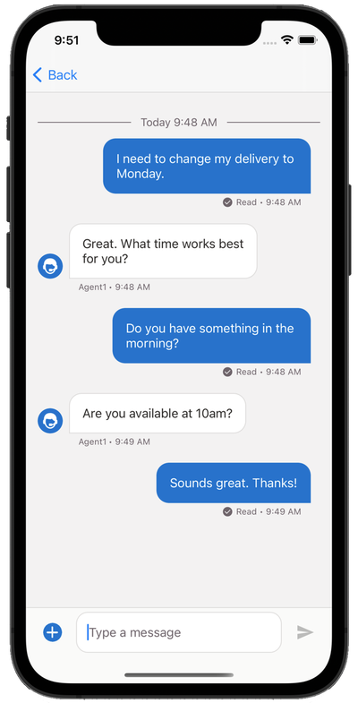

# Salesforce Messaging for In-App (iOS SDK)

Start a new conversation with customers from your iOS mobile app. Custom branding and mobile push notifications provide a modern experience.

## iOS SDK Links

- [Messaging for In-App Developer Guide](https://developer.salesforce.com/docs/service/messaging-in-app/overview)
- [iOS Release Notes](https://github.com/Salesforce-Async-Messaging/messaging-in-app-ios/releases)
- [iOS Example Apps](./examples)
- [iOS Reference Documentation](https://salesforce-async-messaging.github.io/messaging-in-app-ios/)

## Other Messaging for In-App Links

- [Salesforce Org Setup Instructions](https://help.salesforce.com/s/articleView?id=sf.miaw_setup_stages.htm)
- [Android Messaging for In-App GitHub Repo](https://github.com/Salesforce-Async-Messaging/messaging-in-app-android)

## Enhanced Chat Samples

#### Core Feature Samples

- [Hidden Pre-Chat](./examples/Shared/Delegates/CoreDelegate/GlobalCoreDelegateHandler+HiddenPreChat.swift) - Automatically send pre-chat values without prompting the user.
- [Templated URL](./examples/Shared/Delegates/CoreDelegate/GlobalCoreDelegateHandler+TemplatedURL.swift) - Provide dynamic values for auto-response URL parameters at runtime.
- [User Verification](./examples/Shared/Delegates/CoreDelegate/GlobalCoreDelegateHandler+UserVerification.swift) - Verify users before allowing them to access conversations.
- [Delegate Registration](./examples/Shared/Delegates/CoreDelegate/GlobalCoreDelegateHandler.swift) - Centralized delegate registration pattern.
- [Conversation Client Delegate](./examples/Shared/Delegates/CoreDelegate/GlobalCoreDelegateHandler+ConversationClient.swift) - React to conversation events and participant changes.

#### UI Feature Samples

- [SwiftUI Integration](./examples/MessagingUIExample/Views/ContentView.swift) - Present the chat interface in a SwiftUI app.
- [UIKit Integration](./examples/MessagingUIExample/Views/UIKitMIAW.swift) - Present the chat interface via push navigation or modally in UIKit.
- [Populate Pre-Chat](./examples/Shared/Delegates/Providers/TestPrePopulatedPreChatProvider.swift) - Populate pre-chat fields with default values.
- [UI Replacement](./examples/Shared/Delegates/Providers/TestEntryViewBuilder.swift) - Conditionally replace or hide components of the out-of-the-box UI.
- [Navigation Bar Customization](./examples/Shared/Delegates/Providers/TestNavBarBuilder.swift) - Customize the navigation bar per screen.

#### Branding and Customization

- [Color Override](./examples/MessagingUIExample/Assets.xcassets/SMI.Error.colorset) - Override SDK colors by adding color sets with SDK token names (e.g., `SMI.primary`, `SMI.sentBubbleBackground`). See [Customize Colors](https://developer.salesforce.com/docs/service/messaging-in-app/guide/ios-colors.html).
- [Icon Override](./examples/MessagingUIExample/Assets.xcassets) - Override SDK icons by adding image sets with SDK keywords (e.g., `SMI.actionSend`, `SMI.avatarBot`). See [Customize Icons](https://developer.salesforce.com/docs/service/messaging-in-app/guide/ios-icons.html).
- [String Override](./examples/MessagingUIExample/Localizable.strings) - Override SDK UI text by adding string keys to `Localizable.strings` (e.g., `SMI.Chat.Feed.Title`). See [Customize Strings](https://developer.salesforce.com/docs/service/messaging-in-app/guide/ios-strings.html).

#### Replacement UI Views

- [Entry Container](./examples/Shared/ReplacementUI/Views/EntryContainerReplacement.swift) - Determine message origin (user, agent, or system) and apply layout accordingly.
- [Text Message](./examples/Shared/ReplacementUI/Models/ConversationEntry/TextMessageReplacement.swift) - Custom text message model.
- [Text Bubble](./examples/Shared/ReplacementUI/Views/TextReplacement.swift) - Custom text bubble view.
- [Image](./examples/Shared/ReplacementUI/Views/ImageReplacement.swift) - Custom image attachment view.
- [Attachment](./examples/Shared/ReplacementUI/Models/ConversationEntry/AttachmentReplacement.swift) - Custom file/image attachment model.
- [Carousel](./examples/Shared/ReplacementUI/Models/ConversationEntry/CarouselReplacement.swift) - Custom carousel model.
- [Choice Response](./examples/Shared/ReplacementUI/Models/ConversationEntry/ChoiceResponseReplacement.swift) - Custom choice/selection model.
- [Form Inputs](./examples/Shared/ReplacementUI/Models/ConversationEntry/FormInputsReplacement.swift) - Custom form input model.
- [Form Result](./examples/Shared/ReplacementUI/Models/ConversationEntry/FormResultReplacement.swift) - Custom form result model.
- [List Picker](./examples/Shared/ReplacementUI/Models/ConversationEntry/ListPickerReplacement.swift) - Custom list picker model.
- [Quick Reply](./examples/Shared/ReplacementUI/Models/ConversationEntry/QuickReplyReplacement.swift) - Custom quick reply model.
- [Rich Link](./examples/Shared/ReplacementUI/Models/ConversationEntry/RichLinkReplacement.swift) - Custom rich link model.
- [Web View](./examples/Shared/ReplacementUI/Models/ConversationEntry/WebViewReplacement.swift) - Custom web view model.
- [Participant Changed](./examples/Shared/ReplacementUI/Models/ConversationEntry/ParticipantChangedReplacement.swift) - Custom view for agent joined/left events.
- [Session Status Changed](./examples/Shared/ReplacementUI/Models/ConversationEntry/SessionStatusChangedReplacement.swift) - Custom view for session ended events.
- [Typing Indicator](./examples/Shared/ReplacementUI/Models/TypingIndicatorReplacement.swift) - Custom typing indicator.
- [Progress Indicator](./examples/Shared/ReplacementUI/Models/ProgressIndicatorReplacement.swift) - Custom progress/loading indicator.
- [Date Break](./examples/Shared/ReplacementUI/Models/DateBreakReplacement.swift) - Custom date separator.
- [Pre-Chat Receipt](./examples/Shared/ReplacementUI/Models/PreChatReceiptReplacement.swift) - Custom pre-chat receipt.
- [Queue Position](./examples/Shared/ReplacementUI/Models/QueuePositionReplacement.swift) - Custom queue position display.
- [Conversation Closed](./examples/Shared/ReplacementUI/Views/ConversationClosedReplacement.swift) - Custom conversation closed state.

#### Sample Components

> **Note:** These are sample implementations built on top of the SDK, demonstrating common UI patterns. They are not part of the SDK itself.

- [Widget](./examples/MessagingUIExample/Views/MessagingSessionWidget.swift) - A floating widget that displays session status, queue position, and agent name with unread count.
- [Widget View](./examples/MessagingUIExample/Views/MessagingSessionWidgetView.swift) - SwiftUI view for the messaging session widget.
- [Widget Delegate](./examples/MessagingUIExample/Views/WidgetViewController+ConversationClientDelegate.swift) - ConversationClientDelegate handling for the widget.

#### Sample Enums

- [UI Replacement Category](./examples/Shared/Enums/UIReplacementCategory.swift) - Categories for UI replacement toggling.
- [Nav Bar Replacement Category](./examples/Shared/Enums/NavBarReplacementCategory.swift) - Categories for navigation bar replacement toggling.

#### Sample Settings

- [Connection Configuration](./examples/Shared/Settings/Models/ConnectionConfigurationModel.swift) - Manage org ID, developer name, endpoint URL, and conversation ID.
- [Conversation Management](./examples/Shared/Settings/Sections/ConversationManagement/ConversationManagementSettings.swift) - Close conversations and end sessions.
- [Conversation Picker](./examples/Shared/Settings/Sections/ConversationManagement/ConversationPicker.swift) - List and select conversations.
- [Database Management](./examples/Shared/Settings/Sections/DatabaseManagement/DatabaseManagementSettings.swift) - Clear local storage.
- [File Type Management](./examples/Shared/Settings/Sections/FileTypeManagement/FileTypeSettings.swift) - Configure allowed attachment file types.
- [Logging](./examples/Shared/Settings/Sections/Logging/LoggingSettings.swift) - Enable/disable debug logging.
- [Remote Locale](./examples/Shared/Settings/Sections/RemoteLocale/RemoteLocaleSettings.swift) - Map device locales to server locales.

